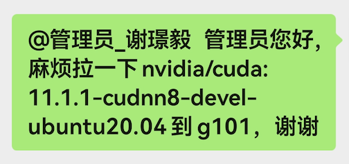
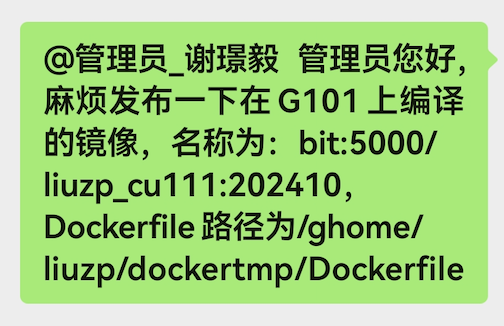

# 信院集群使用教程之外挂环境
lzp59@mail.ustc.edu.cn  
2024.10.30

### 更新日志
- 更新[磁盘使用情况统计](#统计所有文件文件夹大小-包含隐藏的文件)命令
- [创建 conda 环境](#213-创建-conda-环境)增加了一些内容
- 添加 [pip 换源](#pip换源)实用命令
- 添加 Miniconda 安装[相关提醒](#️注意)
- 添加 [PBS 文件编写](#22-编写-pbs-文件提交-job)相关内容
- 添加 [交互式代码调试示例](#以交互式方式进入容器进行代码调试示例相当于使用-startdcker-命令后手动操作-script_file_path-里的内容)

## 0. 使用本教程需要的前置学习内容
1. 信院集群[使用手册](https://git.ustc.edu.cn/ypb/gpu-cluster)
2. Conda[使用方法](https://zhuanlan.zhihu.com/p/483716942)
3. Docker[基础知识](https://www.runoob.com/docker/docker-tutorial.html)

## 1. 为什么要使用外挂环境
集群使用 PBS 调度系统管理 job，job 在容器中运行，容器与镜像关联，而集群中运行 job 必须使用自己制作的镜像。

如果按照[使用手册](#0-使用本教程需要的前置学习内容)中的镜像制作方法自己制作，会有许多问题，比如编译麻烦、有数量限制、提交后无法修改等。如果有安装其它包、包版本升级或从源码编译安装等需求，就需要重新制作镜像，而使用外挂环境可以避免这些问题。

简单来说，基础镜像就是一个简陋的只有开机必须文件的系统，按照[使用手册](#0-使用本教程需要的前置学习内容)制作的镜像就是在系统里安装运行代码所需的软件环境，挂载用户目录 ghome、gdata 等则相当于把外置硬盘接入系统，而外挂环境则相当于把运行代码所需的软件环境安装在外置硬盘上，这样就可以在不改变镜像的情况下修改软件环境。

## 2. 使用外挂环境
### 2.0. 准备工作
1. [申请集群账号](https://data-science.ustc.edu.cn/_upload/article/files/49/eb/a587f35745a6b61c69f0da271e8e/aefd6cfe-ecbf-404d-8994-fd133e7bf074.pdf)
2. 登录集群，推荐 VS code、Xshell、WinSCP、iTerm2、FileZilla 等工具  

登录后进入 gwork 节点，ghome/username 目录：
```shell
[liuzp@gwork ~]$
```
3. 安装并配置 [Miniconda](https://docs.anaconda.com/miniconda/#quick-command-line-install)（⬅️ wget 速度慢的话可以点这里手动下载）  

下面是 Miniconda 官网给出的安装命令：
```shell
# installing
mkdir -p ~/miniconda3
wget https://repo.anaconda.com/miniconda/Miniconda3-latest-Linux-x86_64.sh -O ~/miniconda3/miniconda.sh
bash ~/miniconda3/miniconda.sh -b -u -p ~/miniconda3
rm ~/miniconda3/miniconda.sh

# After installing, close and reopen your terminal application or refresh it by running the following command:
source ~/miniconda3/bin/activate

# To initialize conda on all available shells, run the following command:
conda init --all
```
完成后，可以使用`conda`命令，例如：
```shell
(base)[liuzp@gwork ~]$ conda env list
# conda environments:
#
base                  *  /ghome/liuzp/miniconda3
```
##### ⚠️注意：  
上面的安装命令会把 Miniconda3 安装到 ghome 目录里，但是 ghome 目录限额 50G，所以建议把 Miniconda3 直接安装到 gdata 目录里，注意在后面 Dockerfile 中需要使用 Miniconda 的实际安装目录，当然也可以通过软连接在 ghome 生成一个 gdata/username/miniconda3 的快捷方式，这样就可以在 Dockerfile 中直接使用 /ghome/username/miniconda3 了。  

如果 Miniconda3 已经安装在了 ghome 目录里，可以[参考这里](#ghome-容量不够)，但要注意解压缩会很慢。
### 2.1. 确定需要用的 cuda、torch、python 等软件包的版本，并制作镜像和 conda 环境
#### 2.1.1. 确定软件包版本
这里建议首先考虑 cuda 版本，因为集群不同节点支持的 cuda 版本不同.  
使用 ssh 登录集群，在 gwork 节点运行 chk_gpu 可以看到集群所有 job 和节点信息，[x] 表示卡被占用：
```shell
(base)[liuzp@gwork ~]$ chk_gpu
Jobid	User	   JobName       		Req_parm    Queue_time	    S Run_time   Alloc_GPUS

108305	tangcb     ..former_oldlong30	1:gpus=8:f  20241004 02:04:08 R 323:40:19  G145-gpu/7/6/5/4/3/2/1/0
...
...
...
113054	wangzx     rmv               	1:gpus=8:E  20241030 12:01:09 R 01:37:13   G114-gpu/7/6/5/4/3/2/1/0

GPU used detail:
--1080Ti--  Valid type: 1:S  2:D  4:Q  8:E  ----
         0  1  2  3  4  5  6  7
101(T):	[ ][ ][ ]
102(E):	[ ][ ][ ][ ][ ][ ][ ][ ]
...

--2080Ti--  Valid type: 1:s  2:d  4:q  8:e ----
         0  1  2  3  4  5  6  7
171(e):	[x][x][x][x][x][x][x][x]
...
...
...

Total 125 jobs.
```
使用 chk_gpuused <节点名> 可以查看节点具体卡的使用情况，例如：
```shell
(base)[liuzp@gwork ~]$ chk_gpuused G102
====Node G102====
Wed Oct 30 13:30:52 2024
+-----------------------------------------------------------------------------------------+
| NVIDIA-SMI 550.76                 Driver Version: 550.76         CUDA Version: 12.4     |
|-----------------------------------------+------------------------+----------------------+
| GPU  Name                 Persistence-M | Bus-Id          Disp.A | Volatile Uncorr. ECC |
| Fan  Temp   Perf          Pwr:Usage/Cap |           Memory-Usage | GPU-Util  Compute M. |
|                                         |                        |               MIG M. |
|=========================================+========================+======================|
...
...
...
+-----------------------------------------+------------------------+----------------------+

+-----------------------------------------------------------------------------------------+
| Processes:                                                                              |
|  GPU   GI   CI        PID   Type   Process name                              GPU Memory |
|        ID   ID                                                               Usage      |
|=========================================================================================|
|  No running processes found                                                             |
+-----------------------------------------------------------------------------------------+
```
其中 CUDA Version: 12.4 表示该节点支持的最高 cuda 版本，不同节点支持的最高  cuda 版本统计如下（2024年10月统计）：
>1080Ti  
全为 12.4
>
>2080Ti  
全为 12.4
>
>3080Ti  
全为 12.4
>
>3090  
118(C): 11.4  
121(C): 11.2  
135(C): 11.4  
136(C): 11.4  
137(C): 11.4  
138(F): 11.4  
其他全为 12.4  
>
>A40   
全为 12.4  

以使用 3090 为例，3090 节点中 cuda 最低为 11.2，且对应节点标识为 C，表示该节点最高支持 4 卡任务（标识符规则见[PBS文件编写部分](#22-编写-pbs-文件提交-job)），在提交 4 卡 3090 任务时如果被分配到这个节点，我们使用的镜像中 cuda 版本就不能高于 11.2，否则会报错。

以使用 4 卡 3090 为例，在确定了 cuda 版本为最高 11.2 之后，再确定 torch 版本，到 pytorch 官方仓库寻找，访问以下链接：  
https://download.pytorch.org/whl/cu112/torch  
点击发现无法访问，那就降cuda版本到11.1，再次访问：  
https://download.pytorch.org/whl/cu111/torch

按 Ctrl+F 搜索，输入 linux，找到想要的版本，例如：
>torch-1.10.2+cu111-cp39-cp39-linux_x86_64.whl

也就是说确定 torch 版本为 1.10.2，一般这时 python 版本也确定了，即 cp39 代表 python3.9

接下来就可以制作镜像和conda环境了
#### 2.1.2. 制作镜像
先上[Docker Hub](https://hub.docker.com/r/nvidia/cuda/tags)，filter tags 处输入 11.1，选择需要的镜像，例如：
>11.1.1-cudnn8-devel-ubuntu20.04

<span style="color:red;">最好选带 devel 版本的</span>，关于 devel 版本和 runtime 版本的区别可以自行百度

然后联系管理员将镜像拉取到G101，例如：  


在 ghome/username 目录下创建一个文件夹，名为 dockertmp， 在该文件夹下创建文件，名为 Dockerfile，内容如下：
```shell
FROM nvidia/cuda:11.1.1-cudnn8-devel-ubuntu20.04

WORKDIR / 

ENV TZ=Asia/Shanghai

RUN ln -sf /usr/share/zoneinfo/$TZ /etc/localtime && \
    echo $TZ >/etc/timezone && \
    apt update -y && apt upgrade -y && DEBIAN_FRONTEND=noninteractive apt install -y --no-install-recommends  \
    gcc \
    git \
    git-lfs \
    wget \
    vim \
    libopenmpi-dev \
    openmpi-bin && \
    apt autoremove -y && apt autoclean -y \
    && rm -rf /var/lib/apt/lists/* && rm -rf /tmp/* && rm -rf ~/.cache
ENV PATH="/ghome/liuzp/miniconda3/bin:${PATH}" \
    PYTHONUNBUFFERED=1 \
    GRADIO_SERVER_PORT=31893 \
    API_PORT=8000 \
    LANG=C.UTF-8 \
    LC_ALL=C.UTF-8
    
# ENV GRADIO_SERVER_PORT 31893
EXPOSE 31893

# ENV API_PORT 8000
EXPOSE 8000
```
需要修改的部分：
- FROM nvidia/cuda:11.1.1-cudnn8-devel-ubuntu20.04：<span style="color:red;">关键步骤，选择的基础镜像</span>
- ENV PATH="/ghome/liuzp/miniconda3/bin:${PATH}"：<span style="color:red;">关键步骤，将 miniconda 的 bin 目录加入 PATH</span>，前面提到过镜像相当于一个系统，这一步相当于告诉系统 conda 在哪里
- 其他步骤不用改，具体含义可以问 ChatGPT

准备就绪后，切换到 g101 节点，进入 dockertmp 目录，运行以下命令查看管理员是否已将所需基础镜像拉过来：
```shell
(base) [liuzp@gwork ~]$ ssh g101
Last login: Thu Oct 24 14:12:38 2024 from 192.168.9.99
(base) [liuzp@G101 ~]$ cd dockertmp/
(base) [liuzp@G101 dockertmp]$ docker images -a
REPOSITORY                                       TAG       IMAGE ID       CREATED         SIZE
bit:5000/liulei2_thop                            latest    97673c096fea   22 hours ago    9.06GB
...
...
```

如果有，运行以下命令编译镜像：
```shell
(base) [liuzp@G101 dockertmp]$ docker build -t bit:5000/<image_name>:<image_tag> .
```
<image_name>:<image_tag>请自行定义

编译完成后联系管理员将镜像推送到集群私有仓库，然后就可以在计算节点使用了，例如：  
  

#### 2.1.3. 创建 conda 环境
在 gwork 或 g101 节点上，创建 conda 环境，例如：
```shell
(base) [liuzp@gwork ~]$ conda create -n <env_name> python=3.9 -y
```
激活环境：
```shell
(base) [liuzp@gwork ~]$ conda activate <env_name>
```
安装torch等软件包：
```shell
(<env_name>) [liuzp@gwork ~]$ pip install --no-cache-dir torch==1.10.2+cu111 -i https://download.pytorch.org/whl/cu111
```
```shell
(<env_name>) [liuzp@gwork ~]$ pip install --no-cache-dir transformers -i https://mirrors.tuna.tsinghua.edu.cn/pypi/web/simple
```  
如果需要依赖 cuda 等进行编译安装，可以在 g101 以交互式方式进入容器，然后在容器内激活环境进行编译安装，最后退出容器即可。集群不保存用户对镜像本身的修改，但是这样安装的软件包会保存在 ghome/username/miniconda3/envs, 具体操作过程类似于[交互式调试代码](#以交互式方式进入容器进行代码调试示例相当于使用-startdcker-命令后手动操作-script_file_path-里的内容)  

### 2.2. 编写 PBS 文件，提交 job
使用 WinSCP、FileZilla 等工具将代码、数据等 copy 到 ghome、gdata 等目录，然后找个文件夹编写 PBS 文件，命名为 xxxx.pbs，内容如下：
```shell
#PBS -N jobname
#PBS -o /ghome/liuzp/mycode/run.out
#PBS -e /ghome/liuzp/mycode/run.err
#PBS -l nodes=1:gpus=4:C
#PBS -r y
#PBS -m abef

SCRIPT_FILE_PATH=/ghome/liuzp/mycode/run.sh
IMAGE_NAME=bit:5000/liuzp_cu111:202410

cd $PBS_O_WORKDIR
echo Time is `date`
echo Directory is $PWD
echo This job runs on following nodes:
echo -n "Node:"
cat $PBS_NODEFILE
echo -n "Gpus:"
cat $PBS_GPUFILE
echo "CUDA_VISIBLE_DEVICES:"$CUDA_VISIBLE_DEVICES

chmod +x $SCRIPT_FILE_PATH
startdocker -P /ghome/liuzp -D /gdata/liuzp \
-u "--ipc=host --shm-size 192G -e HOME=/ghome/liuzp" \
-s $SCRIPT_FILE_PATH \
$IMAGE_NAME


```
需要修改的部分：
1. #PBS -N jobname：jobname 为 job 名
2. #PBS -o /ghome/liuzp/mycode/run.out：指定输出文件路径
3. #PBS -e /ghome/liuzp/mycode/run.err：指定错误文件路径
4. 4:C：申请的卡数和卡类型，根据 chk_gpu 查看，以 3090 为例，chk_gpu 显示Valid type: 1:A  2:B  4:C  8:F，表示如果想用一张 3090，就是 1:A，如果想用 4 张 3090，就是 4:C，以此类推
5. SCRIPT_FILE_PATH=/ghome/liuzp/mycode/run.sh：指定运行脚本路径
6. IMAGE_NAME=bit:5000/liuzp_cu111:202410：指定使用的镜像
7. startdocker：指定挂载目录，-P 为挂载用户目录，-D 为挂载数据目录，192G 表示申请内存大小，-e HOME=/ghome/liuzp 表示将用户目录设为容器中的 HOME 目录，<span style="color:red;">把 username 都换成自己的用户名即可</span>
8. 其他不用动，在 pbs 文件、要运行的脚本文件、python 代码中，要进行文件读写或运行文件时最好都用绝对路径
9. ❗️❗️❗️重要：vim中编辑 pbs 文件末尾要有一个空行，如果在 VS code 中编辑，要有两个空行

SCRIPT_FILE_PATH=/ghome/liuzp/mycode/run.sh 编写如下：
```shell
#!/bin/bash
# 指定工作目录
DIR_PATH=/ghome/liuzp/mycode/
cd $DIR_PATH

# 初始化conda
. /ghome/liuzp/.bashrc

# 激活conda环境
conda activate <env_name>

# 运行代码
python run.py
# 这里就跟平时在本地终端运行代码一样了，也可以用 torchrun、accelerate launch 等启动方式 
```

编写完后，提交 job：
```shell
(base) [liuzp@gwork pbs]$ qsub xxxx.pbs
```

大功告成！

## 3. 其他
### 3.1. 调试代码
##### 在 g101 节点上调试代码
```shell
(base) [liuzp@gwork ~]$ ssh g101
Last login: Wed Oct 30 14:36:42 2024 from 192.168.9.99
(base) [liuzp@G101 ~]$
```
##### 使用 nvidia-smi 查看卡的使用情况

##### 查看当前可见的显卡：
```shell
(base) [liuzp@G101 ~]$ echo $CUDA_VISIBLE_DEVICES
```
##### 指定要用的卡号：
```shell
(base) [liuzp@G101 ~]$ export CUDA_VISIBLE_DEVICES="0,1"
```
##### 调试代码，其实就是pbs文件的 startdocker 命令直接运行：
```shell
(base) [liuzp@G101 ~]$ startdocker -P /ghome/liuzp -D /gdata/liuzp -u "--ipc=host --shm-size 64G -e HOME=/ghome/liuzp" -s /ghome/liuzp/mycode/run.sh bit:5000/liuzp_cu111:202410
```
##### 查看正在运行的容器以及获取容器 id：
```shell
(base) [liuzp@G101 ~]$ docker ps -a
```
##### 结束正在运行的容器：
```shell
(base) [liuzp@G101 ~]$ docker stop <container_id>
```
##### 以交互式方式进入容器进行代码调试示例（相当于使用 startdcker 命令后手动操作 SCRIPT_FILE_PATH 里的内容）：
```shell
# 登录到 g101 节点
(base) [liuzp@gwork ~]$ ssh g101
Last login: Wed Oct 30 22:34:07 2024 from 192.168.9.99
# 查看 gpu 使用情况
(base) [liuzp@G101 ~]$ nvidia-smi
...
# 指定要用的卡号，不指定的话会随机分一张卡
(base) [liuzp@G101 ~]$ export CUDA_VISIBLE_DEVICES="0,1"
# 以交互式方式进入容器，在 g101 使用 startdocker 命令默认挂载了用户目录，可按需手动挂载数据目录，
# -it 表示交互式启动，-e HOME=/ghome/liuzp 表示将用户目录设为容器中的 HOME 目录，
# -c /bin/bash 表示启动容器后打开 bash 命令行， bit:5000/liuzp_cu111:202410 为使用的镜像名
(base) [liuzp@G101 ~]$ startdocker -D /gdata/liuzp -u "-it -e HOME=/ghome/liuzp" -c /bin/bash bit:5000/liuzp_cu111:202410
# 进入容器后，可以看到命令行变为：
I have no name!@a915c03bade3:/$
# 查看容器中都有什么
I have no name!@a915c03bade3:/$ ls -a
.			  bin	gdata  lib32   mnt   run   tmp
..			  boot	ghome  lib64   opt   sbin  usr
.dockerenv		  dev	home   libx32  proc  srv   var
NGC-DL-CONTAINER-LICENSE  etc	lib    media   root  sys
# 可以看到常规 Linux 系统该有的目录这里都有，而且还有挂载的用户目录 ghome 和数据目录 gdata
# 此时可以执行一些命令检查镜像中的环境，例如：
I have no name!@a915c03bade3:/$ nvcc -V
I have no name!@a915c03bade3:/$ gcc -v
I have no name!@a915c03bade3:/$ nvidia-smi
# 要使用 conda，还需要进行初始化，运行：
I have no name!@a915c03bade3:/$ . /ghome/liuzp/.bashrc
# 然后就可以查看 conda 环境，运行：
I have no name!@a915c03bade3:/$ conda env list
# 激活 conda 环境，运行：
I have no name!@a915c03bade3:/$ conda activate <env_name>
# 检查 torch 版本，运行：
(<env_name>) I have no name!@a915c03bade3:/$ python -c "import torch; print(torch.__version__)"
# 调试代码
(<env_name>) I have no name!@a915c03bade3:/$ python xxxx/xxx/run.py
```
### 3.2. 管理job
##### 查看所有 job 状态：
```shell
(base) [liuzp@gwork ~]$ chk_gpu
```
##### 查看自己的 job 状态：
```shell
(base) [liuzp@gwork ~]$ qstat -u $USER
```
##### 结束 job：
```shell
(base) [liuzp@gwork ~]$ qdel <job_id>
```
##### 查看节点 cpu 负载：
```shell
(base) [liuzp@gwork ~]$ sudo chk_res <结点名>
```
##### 查看 job 的实时 log 输出：
```shell
(base) [liuzp@gwork ~]$ dockerlog <jobid> 
```
##### 查看卡时：
```shell
(base) [liuzp@gwork ~]$ sudo get_report
```
### 3.3. 实用命令
##### 查看私有仓库所有镜像：
```shell
(base) [liuzp@gwork ~]$ getallreposimages
```
##### 统计所有文件/文件夹大小 （包含隐藏的文件）:
```shell
(base) [liuzp@gwork ~]$ du -sh .[!.]* * | sort -hr
```

##### 发送通知：  
注册[Sever酱](https://sct.ftqq.com/login)，获取 SendKEY，然后就可以给微信发送通知，及时获取 job 状态，有些节点会发送失败，请及时关注 out 文件  
使用示例：
```python
def send(title: str, desp: str=''):
    try:
        import requests
        requests.post(url='https://sctapi.ftqq.com/<your_send_key>.send', json={'title': title, 'desp': desp, **{}}, headers={'Content-Type': 'application/json;charset=utf-8'}, timeout=20)
    except Exception as e:
        print("********************** send error **********************")
        print(e)
        print("********************************************************")

def main():
    pass

if __name__ == '__main__':

    send(title="Start train job", desp='<job name>')
    
    try:
        main()
        send(title="Successfully train job", desp='<job name>')
    except Exception as e:
        print("********************* train error **********************")
        print(e)
        print("********************************************************")
        send(title=f"Failed train job", desp='<job name>')
        exit()
```

##### ghome 容量不够：  
如果 miniconda3 虚拟环境过多导致ghome容量不够，可以用软连接把虚拟环境放到 gdata 目录下，[参考教程](https://blog.csdn.net/Better_ava/article/details/134104479)    

##### 清理 conda 和 pip 缓存：
```shell
(base) [liuzp@gwork ~]$ conda clean -a -y
(base) [liuzp@gwork ~]$ conda clean -p -y
(base) [liuzp@gwork ~]$ pip cache purge
# 使用 pip 时直接加上 --no-cache-dir 参数，例如：
(<env_name>) [liuzp@gwork ~]$ pip install --no-cache-dir xxx
```

##### pip换源：
```shell
# 临时换源
pip install torch==1.10.2+cu111 -i https://download.pytorch.org/whl/cu111
pip install transformers -i https://mirrors.tuna.tsinghua.edu.cn/pypi/web/simple
# 永久换源
pip install -i https://mirrors.ustc.edu.cn/pypi/simple pip -U
pip config set global.index-url https://mirrors.ustc.edu.cn/pypi/simple
# 其他源如阿里、豆瓣等可自行搜索
```